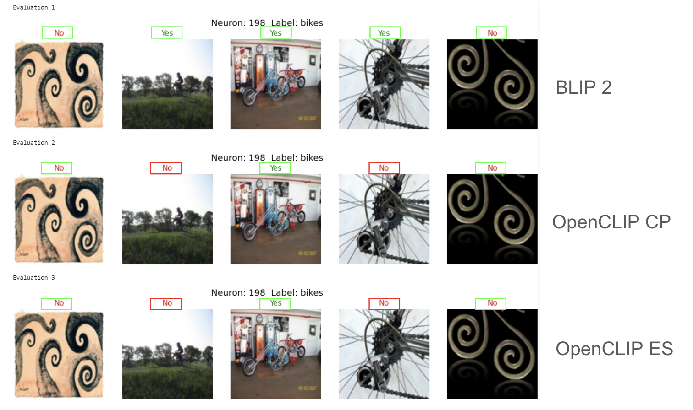

# Introduction

The CLIP-Dissect Automatic Evaluation framework is designed to enhance our understanding of deep neural networks by evaluating the functionality of individual neurons. This novel approach leverages multimodal vision/language models to automatically label neurons with concepts, shedding light on how networks process information.

In this study, we address the challenge of evaluating the interpretability of neurons in deep neural networks, particularly focusing on the innovative CLIP-Dissect method that utilizes multimodal vision/language models for automatic neuron labeling. Recognizing the difficulty in quantitatively assessing hidden neurons due to the absence of ground truths, we propose an automated, qualitative evaluation approach that leverages three distinct methodologies: BLIP-2 prompting, and two OpenCLIP-based methods focusing on concept proportion and embedding similarity.

# Methodology

Our methodology employs three distinct approaches to evaluate neuron labels: BLIP-2 prompting, OpenCLIP with concept proportion, and OpenCLIP with embedding similarity. Each method provides a unique perspective on neuron functionality, utilizing top activating images to assess the relevance of CLIP-Dissect labels. We use these tools on CLIP-Dissects results to evaluate each neuron label with their associated activating images.

# Key Findings

- **Qualitative Insights**: BLIP-2 demonstrates a nuanced understanding of activating images, closely aligning with human evaluations. OpenCLIP methods offer a more binary assessment, emphasizing direct similarity between image and neuron labels. BLIP-2 qualitatively seems more robust in picking out nuances within complex settings.

- **Quantitative Analysis**: Our evaluation reveals that BLIP-2 achieves the highest Intersection over Union (IoU) score with human evaluations, indicating its superior performance in neuron labeling.

- **Efficiency**: While BLIP-2 offers detailed assessments, its processing time is longer. OpenCLIP methods excel in speed, providing rapid evaluations.

- **Comparisons**: 
In our comparative analysis, the kappa statistic revealed a moderate agreement between human evaluators and the BLIP-2 model, suggesting a reasonable but imperfect alignment in neuron labeling interpretations. The substantial agreement between the two OpenCLIP methodologies indicated consistency in their binary evaluative approach, yet both showed lower agreement with BLIP-2, highlighting differing strategies in neuron evaluation.

# Discussion

The disparity between automated methods and human judgments highlights the complexity of achieving interpretability in neural networks. Our framework's adaptability allows for integration with advanced models, ensuring the evaluation process remains state of the art.

# Conclusion

The CLIP-Dissect Automatic Evaluation is a framework that provides a structured and automated means of evaluating neuron labels, in turn aiding researchers in understanding and improving neural network interpretability.

